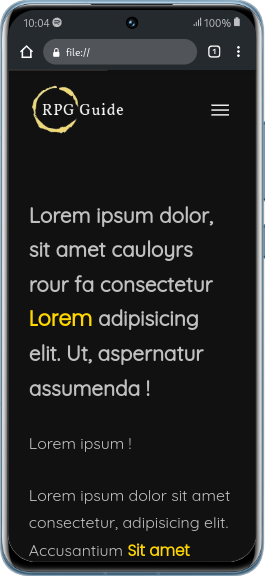
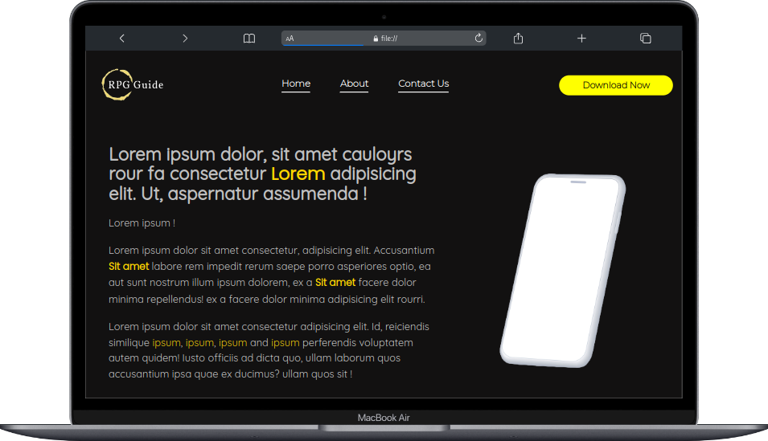

# Template de página web

O template tem como intuito divulgar um aplicativo para celular (disponível para Android e IOS), contando com efeitos de aparições de elementos ao dar scroll na página e um design simples, porém elegante. O template também é adaptado para dispositivos mobile.

 

🚨 As imagens e fotos utilizadas <b>não</b> possuem direitos autorais!

🖥 Veja o template aqui -> <a href="https://marcusfrancisquini.github.io/Template-app-mobile/">marcusfrancisquini.github.io/Template-app-mobile</a>

 
 

 
 

